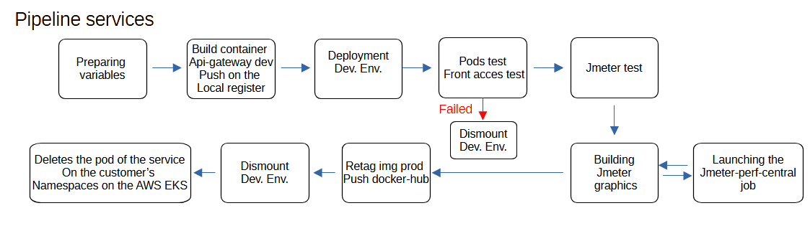

# JENKINS PIPELINE & TOOLS

<b>checkNamespaceUse.sh</b> : 

Script used into the pipeline to check if pod is active on the namespace, if it's used the script tempo 5 minute and retry 12 time to wait one hour or fail the pipeline

<b>checkpod.sh : </b>

Script used to check the pod health after deployment, 

If the pod has restarted it show the java error cause into the pipeline and write the full log into the log’s directory. 

If the pod are not in running state, it print the event list from the description of the pod ( cmd : kubectl describe pod ).

<b>updatePod.sh :</b>

This script is use into the pipeline vets-service, visits-service, customers-service. The script deletes of the pod of the service the just gone through the pipeline.

The purpose is to update the production environment with the last push on the image on Docker-Hub. It uses a loop on every "petclinic" namespace. 

<b>updatePod-gateway.sh :</b>

Script used into the api-gateway-client pipeline only, this pipeline is customized by the customers parameters. it deletes the api-gateway pod only on the customer’s namespace that just gone through the pipeline.

<b>client-list.csv :</b>

Exemple of the csv file with the parameters used by the Jenkins child api-gateway pipeline, the parameters are clientName;colorHexCode;nodePort. 

<b>Jenkinsfile-gateway :</b>

<b>Jenkinsfile-service : </b>

<b>Jenkinsfile-child-gateway :</b>

