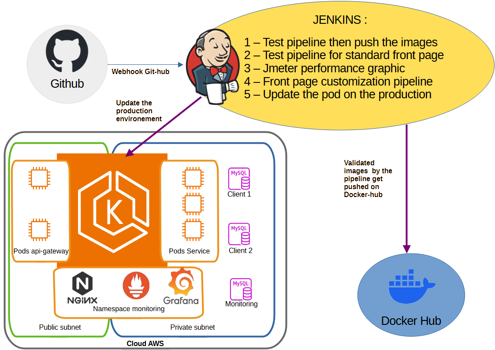

# spring-petclinic-depo
<b>DISCLAMER :</b> this is not the official repo but a student project, here is the official repository of <a href="//github.com/spring-petclinic/spring-petclinic-cloud/">spring-petclinic-cloud</a>

This repo allows me to share different resource about the realisation of the project Petclinic, in each directory you will find a README.md file to explain more about each component of the project.

Into the directory Jenkins, you will find the different Pipeline, script to assure that pipeline doesn't bother each other and the customer list example use to launch parallel jobs.

Into the directory Helm you will find the two helm chart, one use to deploy in production and the other in the development environment. You will also find the script used to customize the prometheus-community/kube-prometheus-stack helm chart.

Into the directory Dockerfile you will find the evolution of the Dockerfile.

Into the terraform directory I will put the terraform chart to build the VPC/EKS-cluster/EKS-Nodegroup/RDS use to deploy two customers.
